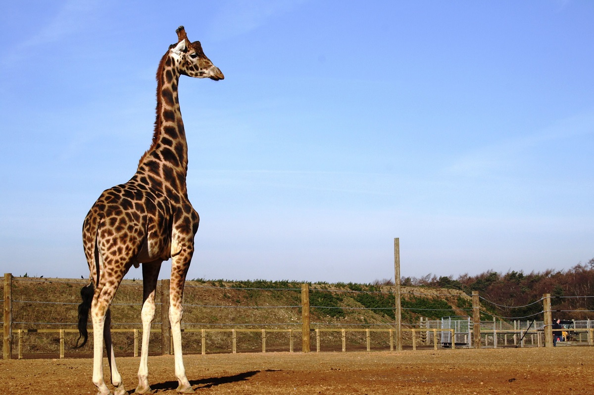

<h1 align="center">VueSolitaire</h1>
<h2 align="center">

</h2>

  

 A giraffe standing next to a other on a field. 

## Description

Я использовал  качестве cnn - Inceptionv3. Полученные с её помощью эмбеддинги(emb_size) с помощью линейного слоя переводились в размерность hidden_size
Далее полученные эмбеддинги картинки использовались в качестве первого слова, которое подаётся в lstm. 
По нему сеть должна была сгенерировать токен начала предложения. После него в модель подавались слова из описания при тренировке и слова, которые сеть сгенерировала до это при тесте.

image_captioning2.ipynb - ноутбук с тренировкой сети

## Heroku

https://gigasterdlssait.herokuapp.com/handle

Я задеплоил сайт на heroku, но там не хватает памяти, чтобы развернуть сеть. Поэтому она просто не используется(но подразумевается, что используется)

# Weights

https://drive.google.com/file/d/1-0mQXIgr_iabYM9mO5Pk2Ah50lS_5mqY/view?usp=sharing

веса самой лучшей модели